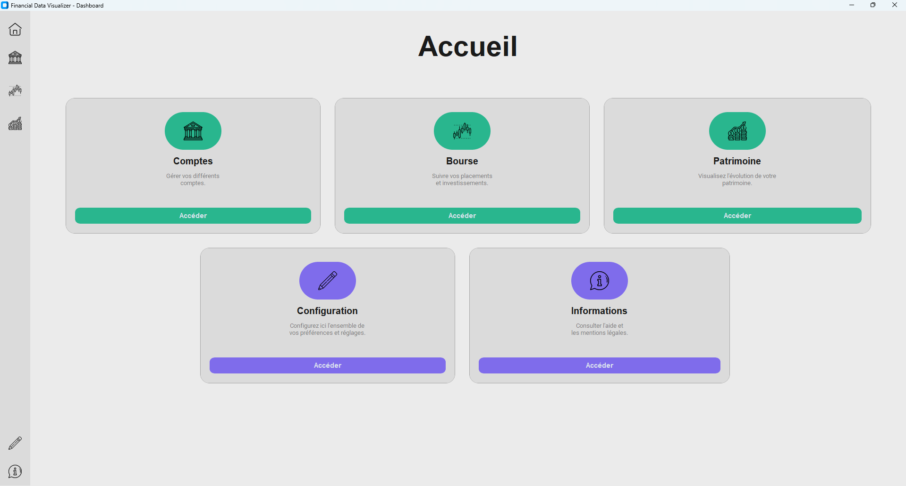
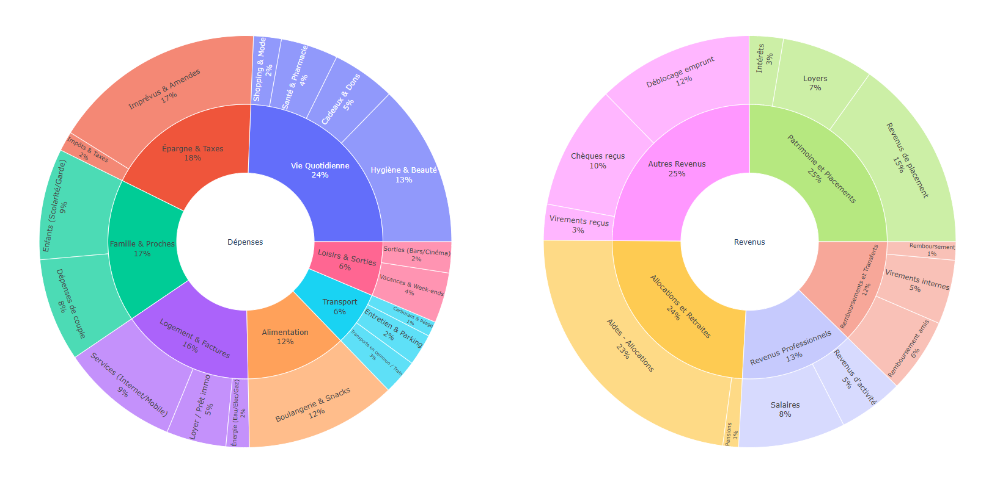
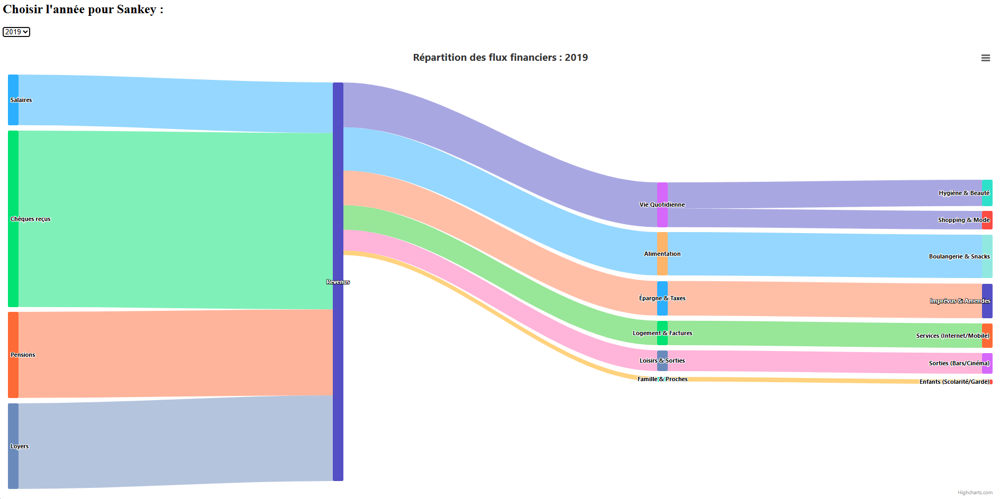
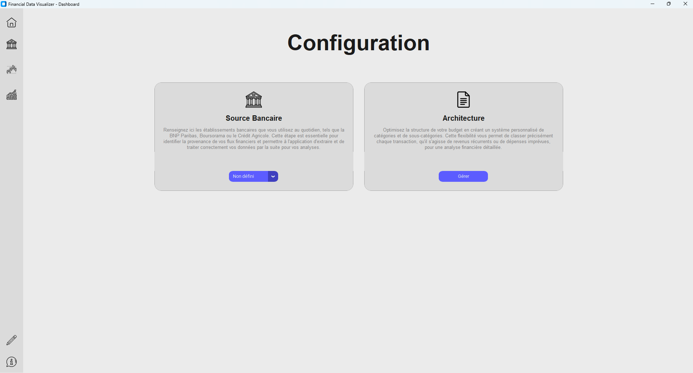
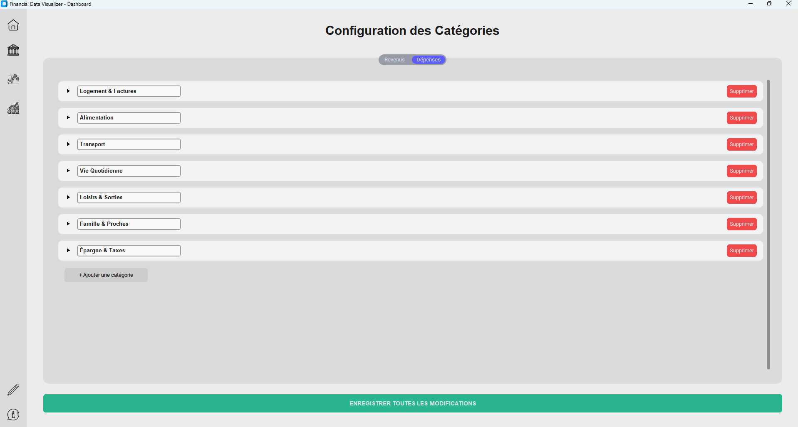
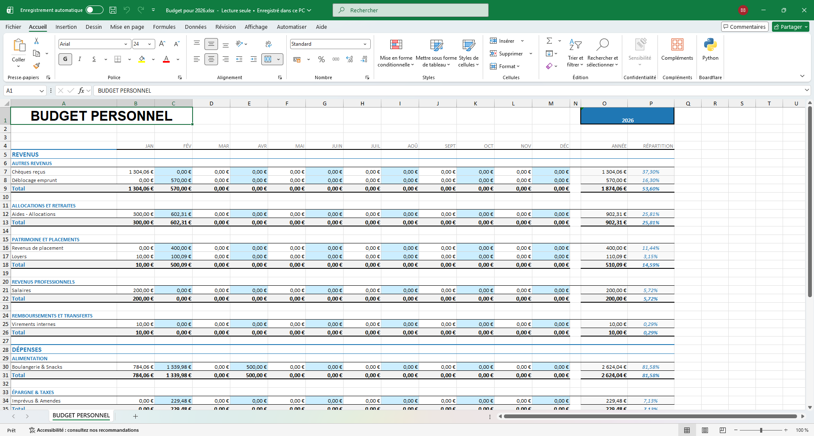

# Financial Data Visualizer - Dashboard 📊

**Financial Data Visualizer** est un outil de gestion et d'analyse financière permettant de transformer des exports bancaires bruts en tableaux de bord interactifs. Le projet permet de centraliser vos flux financiers, de les catégoriser finement et d'obtenir une vision claire de votre santé budgétaire via des rendus HTML dynamiques ou des rapports Excel.

---

## 📸 Aperçu du projet

### Dashboard d'accueil


### Analyses et Graphiques
| Répartition (Donuts) | Flux (Sankey) |
| :---: | :---: |
|  |  |
# Financial Data Visualizer - Dashboard 📊

**Financial Data Visualizer** est un outil de gestion et d'analyse financière permettant de transformer des exports bancaires bruts en tableaux de bord interactifs. Le projet permet de centraliser vos flux financiers, de les catégoriser finement et d'obtenir une vision claire de votre santé budgétaire via des rendus HTML dynamiques ou des rapports Excel.

---

## 📸 Aperçu du projet

### Dashboard d'accueil


### Analyses et Graphiques
| Répartition (Donuts) | Flux (Sankey) |
| :---: | :---: |
|  |  |

---

## 🛠️ Configuration & Utilisation

Pour que l'analyse soit pertinente, vous devez passer par l'étape de configuration initiale dans l'application :

1.  **Source Bancaire** : Sélectionnez l'établissement bancaire correspondant à vos fichiers (BNP Paribas, Boursorama, Crédit Agricole, etc.). Cette étape est cruciale pour que le moteur d'extraction puisse lire correctement vos colonnes Excel.
2.  **Architecture des Catégories** : Définissez vos propres catégories et sous-catégories (ex: *Alimentation > Boulangerie & Snacks*). 
    * *Note : Le projet supporte une gestion complète des suppressions et ajouts pour coller à vos habitudes de vie.*

| Menu Configuration | Gestion des Catégories |
| :---: | :---: |
|  |  |

---

## 📉 Visualisation & Analyse

L'outil génère automatiquement des graphiques d'évolution pour suivre vos dépenses et revenus au fil des mois et des années.

*Évolution globale des flux financiers (Revenus vs Dépenses).*
<video src="https://github.com/user-attachments/assets/63da86e4-b6c0-46cc-a75c-7b29ef818b21" width="100%" controls></video>

*Zoom par catégories et sous-catégories.*
<video src="https://github.com/user-attachments/assets/4ad2a5dc-c363-45b0-8366-ac40f0ee8934" width="100%" controls></video>

---

## 📑 Rapports Excel

En plus de l'interface visuelle, le projet génère un fichier **Budget_2026.xlsx** parfaitement formaté pour ceux qui préfèrent manipuler les données brutes ou conserver une archive statique.



---

## 🚀 Road Map (Futur du projet)

Actuellement focalisé sur l'analyse des **opérations courantes**, le projet évolue pour devenir une solution de gestion de patrimoine complète :
* ➕ **Module Bourse** : Suivi des placements et investissements (actions, ETF).
* ➕ **Patrimoine Global** : Visualisation consolidée (Comptes courants + Épargne + Bourse).

## 🚀 Installation

```bash
# Cloner le dépôt
git clone [https://github.com/votre-utilisateur/financial-data-visualizer.git](https://github.com/votre-utilisateur/financial-data-visualizer.git)

# Installer les dépendances
pip install -r requirements.txt

# Lancer l'application
python main.py
